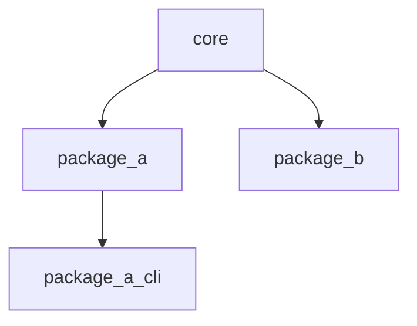

# Architecture and ownership

## Component model

Both language stacks demonstrate the same dependency direction:



- `core` defines shared value types, status contracts, and low-level utilities.
- `package_a` and `package_b` are sibling domain packages. They can depend on `core`, but not on
  one another.
- `package_a_cli` is an application boundary and may depend on `package_a`. Libraries must never
  depend on applications.

These rules keep changes local, make ownership clear, and avoid a collection of packages that is
a monolith in disguise.

## Python conventions

Each Python component is a PEP 517 project with its own `pyproject.toml`, `src` layout, import
namespace, dependencies, and tests. The repository root owns only shared development policy and
the uv workspace.

Use normalized distribution names and unambiguous organization-prefixed import names:

| Component | Distribution | Import package |
| --- | --- | --- |
| Core | `release-lab-core` | `release_lab_core` |
| Package A | `release-lab-package-a` | `release_lab_package_a` |
| Package B | `release-lab-package-b` | `release_lab_package_b` |
| Package A CLI | `release-lab-package-a-cli` | `release_lab_package_a_cli` |

Every dependency must appear in the consuming member's `[project].dependencies`, even though a
shared development environment may make undeclared imports appear to work locally.

Each component owns documentation beneath its own `docs` directory. The repository-level Sphinx
site assembles those pages without moving component-specific guidance into a central hierarchy.

## Native conventions

Native libraries expose behavioural and generated version headers under a namespaced include tree,
such as `<release_lab/package_a.h>` and `<release_lab/package_a_version.h>`. Consumers link through
namespaced CMake aliases:

```cmake
target_link_libraries(my_target PRIVATE release_lab::package_a)
```

Each production target receives warnings, the C17 requirement, optional sanitizers, and
static-analysis integration through `monorepo_set_project_options`. CppUTest targets receive the
corresponding test-only C++17 policy. Target-level policy avoids leaking internal compiler flags
into external consumers.

Native library tests use CppUTest and are registered with CTest; application boundary tests remain
direct CTest process checks. CppUTest is fetched only for test-enabled builds and is excluded from
installed artifacts. Public C headers use `extern "C"` guards so both the harness and downstream
C++ programs can link to the C implementation.

## Adding a Python package

1. Copy an existing directory under `python/packages`.
2. Give the distribution and import package organization-unique names.
3. Add the member to `[tool.uv.workspace].members` if it is outside the existing glob.
4. Declare workspace dependencies normally and add their sources to `[tool.uv.sources]`.
5. Set its version to `version.txt`. Type checks, version checks, and the setter discover members
   from the workspace; no command project lists need updating.
6. Register `project.version` in Release Please's `extra-files` and add the import package to
   coverage's `source` list and Ruff's `known-first-party` list in the root `pyproject.toml`.
7. Add a `SmokeCheck` to `SMOKE_CHECKS` in `tools/repo_tools/src/repo_tools/python_smoke_checks.py`,
   with a public API example and `SmokeCommand` cases for any installed CLI.
8. Create `docs/index.md` with overview, examples, and API reference; link it from `docs/index.md`.
   Retain a distribution README with a short usage example and absolute documentation URL.
9. Run `uv lock`, `uv run repo-tools check-workspace`, and the relevant
   [local checks](testing.md#local-validation).

The workspace checker expands uv member/exclude globs and discovers distribution names and regular
packages at `src/<namespace>/__init__.py`. It verifies smoke namespaces, coverage/Ruff names, and
Release Please's version entries, reporting missing, stale, or duplicate registrations. Overlapping
globs are deduplicated and excluded directories ignored. These remaining registrations describe
policy or examples that cannot be inferred from membership alone.

The checker is read-only and uses the standard library. It runs in Python quality CI and the local
workspace-consistency hook. This template uses regular src-layout packages; adopting namespace
packages or another layout also requires updating discovery. Native registrations retain their
existing CMake and install checks; documentation links are validated by the Sphinx build.

## Adding a native package

1. Create `native/packages/<name>/{include,src,tests}`.
2. Define a library and namespaced alias in its `CMakeLists.txt`.
3. Add a component-owned version-header template and register it with
   `monorepo_add_version_header`.
4. Apply `monorepo_set_project_options` to production C targets and
   `monorepo_set_cpp_test_options` to CppUTest executables.
5. Link only to explicitly declared targets and register the test with CTest.
6. Add install rules for the library, public headers, and the shared `ReleaseLabTargets`
   export. Set `EXPORT_NAME` and build/install include directories like the existing libraries.
7. Add the directory to the root `CMakeLists.txt`.
8. Register the installed version header and macro prefix in `tools/repo_tools/src/repo_tools/commands/check_native_install.py`.
   Extend `native/tests/install_consumer` to link and exercise the new library and version header.
9. Create component-owned `docs` pages and link their index from `docs/index.md`. Add the public
   include directory to `tools/doxygen/Doxyfile`; generated headers are already discovered from
   the shared generated include tree.
10. Run the developer, analysis, sanitizer, and coverage presets, then verify a clean install with
    the external consumer and build the documentation site.

## Consuming a native installation

Build and install the release artifacts, then configure the example downstream consumer using only
an installation prefix:

```bash
cmake --preset release
cmake --build --preset release
cmake --install build/release --prefix stage
cmake -S native/tests/install_consumer -B build/install-consumer -G Ninja \
  -DMONOREPO_INSTALL_PREFIX="$PWD/stage"
cmake --build build/install-consumer
ctest --test-dir build/install-consumer --output-on-failure
```

Downstream CMake projects use `find_package(ReleaseLab CONFIG REQUIRED)` and link the
`release_lab::core`, `release_lab::package_a`, or `release_lab::package_b` targets. The install tree can be
moved without changing its generated CMake files.

Package configuration is installed beneath `<libdir>/cmake/ReleaseLab`. Consumers that
previously set `ReleaseLab_DIR` directly to `<libdir>/cmake/monorepo-template` must update
that path. Prefer `CMAKE_PREFIX_PATH` pointing at the installation prefix. Verify upgrades with a
clean install tree so obsolete configuration files from an older installation do not interfere.

## Cross-language integration

Keep cross-language communication at explicit boundaries. If Python calls a C executable, test
the executable's command-line or protocol contract in an integration suite. If native bindings
are eventually required, create a dedicated Python distribution for that binding rather than
making every Python package depend on the native build.

